# 🛣 Real-Time Road Anomaly Detection on Raspberry Pi 4B

> **IIT Madras — Bharat AI System-on-Chip Challenge**
>
> Edge AI application that processes dashcam footage in real-time to detect and log road anomalies on a Raspberry Pi 4B.

[](https://python.org)
[](https://www.raspberrypi.com)
[](LICENSE)

---

## 📋 Table of Contents

- [Overview](#overview)
- [Architecture](#architecture)
- [Detection Classes](#detection-classes)
- [Hardware Setup](#hardware-setup)
- [Installation](#installation)
- [Quick Start](#quick-start)
- [GUI Application](#gui-application)
- [Pipeline Modes](#pipeline-modes)
- [Benchmarks](#benchmarks)
- [Optimization Techniques](#optimization-techniques)
- [Project Structure](#project-structure)
- [Configuration](#configuration)
- [Output Formats](#output-formats)
- [Team](#team)

---

## Overview

This project deploys a **dual-model AI pipeline** on a Raspberry Pi 4B that detects road anomalies from dashcam video in real-time. It combines a lightweight **convolutional autoencoder** (pre-filter) with **YOLOv26n** (detector) to achieve >10 FPS under severe hardware constraints.

### Key Features

- ⚡ **Real-time inference** on CPU-only hardware (no GPU required)
- 🧠 **Dual-model architecture**: Autoencoder pre-filter + YOLOv26n detector
- 🔄 **Asynchronous YOLO**: Non-blocking inference on background thread
- 📊 **Rich HUD overlay**: AE error, YOLO status, latency, motion %
- 🖥️ **Tkinter GUI**: Live video, AE visualization, anomaly alerts
- 📝 **Structured logging**: Per-frame CSV + per-detection JSONL
- 🌡️ **Hardware benchmarking**: CPU, RAM, temperature monitoring
- 🎯 **Motion-weighted thresholds**: Intelligent anomaly gating

---

## Architecture

### System Pipeline

```mermaid
flowchart TB
    subgraph Thread1["🎥 Thread 1 — Camera I/O"]
        A[Camera / Video Input] --> B[Frame Capture]
    end

    subgraph MainThread["⚙️ Main Thread — Processing"]
        B --> C[Resize to 320×240]
        C --> D[ROI Crop — Bottom 50%]
        D --> E[Motion Detection]
        E --> F{Motion Weight}
        F -->|"< 0.1%: noise"| G["w = 3.0 — skeptical"]
        F -->|"2-30%: sweet spot"| H["w = 1.0 — standard"]
        F -->|"> 50%: shake"| I["w = 1.8 — cautious"]
        G --> J[AE Pre-filter]
        H --> J
        I --> J
        J -->|"Anomaly confirmed"| K[Submit to YOLO Queue]
        J -->|"Normal road"| L[Skip YOLO]
    end

    subgraph Thread23["🧠 Thread 2-3 — YOLO Inference"]
        K --> M[YOLOv26n NCNN]
        M --> N[Detections]
    end

    subgraph Output["📊 Output"]
        N --> O[IoU Tracker]
        L --> O
        O --> P[CSV + JSONL Logs]
        O --> Q[Annotated Video]
        O --> R[GUI Display]
    end

    style Thread1 fill:#1a3a5c,stroke:#4a9eff,color:#fff
    style MainThread fill:#1a3a1a,stroke:#4aff4a,color:#fff
    style Thread23 fill:#3a1a3a,stroke:#ff4aff,color:#fff
    style Output fill:#3a3a1a,stroke:#ffff4a,color:#fff
```



### Decision Flow


### Autoencoder Pipeline

```mermaid
flowchart LR
    A["ROI Frame\n(320×120)"] --> B["Resize\n128×128"]
    B --> C["Normalize\n÷ 255.0"]
    C --> D["Cast to\nFP16"]
    D --> E["ONNX Runtime\nEncoder → Decoder"]
    E --> F["Reconstruction\n128×128"]
    C --> G["Error =\n|Input - Recon|"]
    F --> G
    G --> H["Mean Error"]
    H --> I{"error > τ × w\n2 of 5 frames?"}
    I -->|Yes| J["⚠ Anomaly"]
    I -->|No| K["✓ Normal"]

    style J fill:#ff3333,color:#fff
    style K fill:#33cc33,color:#fff
```



---

## Detection Classes

| Class | Description | Color |
|-------|-------------|-------|
| 🔴 `road_damage` | Potholes, cracks, surface degradation | Red |
| 🟠 `speed_bump` | Unmarked or poorly visible speed bumps | Orange |
| 🟡 `unsurfaced_road` | Transitions from paved to unpaved | Cyan |

---

## Hardware Setup

| Component | Specification |
|-----------|--------------|
| **Board** | Raspberry Pi 4 Model B |
| **CPU** | 4× Cortex-A72 @ 1.5 GHz (ARMv8-A) |
| **RAM** | 4 GB LPDDR4-3200 |
| **Storage** | 32 GB microSD (Class 10) |
| **Cooling** | Aluminium heatsink + active fan |
| **Camera** | Raspberry Pi Camera Module (CSI) |
| **Power** | 5V / 3A USB-C |
| **OS** | Raspberry Pi OS (64-bit, Bookworm) |

---

## Installation

### Prerequisites

```bash
# Python 3.11+
python3 --version

# System dependencies (RPi)
sudo apt update
sudo apt install -y python3-pip python3-opencv libatlas-base-dev
```

### Setup

```bash
# Clone repository
git clone https://github.com/team/roadanon1.git
cd roadanon1

# Create virtual environment
python3 -m venv venv
source venv/bin/activate

# Install dependencies
pip install -r requirements.txt

# NCNN (build from source on RPi for ARM NEON support)
# See docs/ncnn_install.md for detailed instructions
```

### Model Files

Place model files in `models/`:

```
models/
├── best.param          # YOLOv26n NCNN parameter file
├── best.bin            # YOLOv26n NCNN weights
└── autoencoder_fp16.onnx  # Autoencoder ONNX (FP16)
```

---

## Quick Start

### Run Pipeline (Headless)

```bash
# Process video files
python pipeline.py --sources test_video/*.mp4 --profile

# RPi optimized preset
python pipeline.py --rpi --sources test_video/*.mp4 --profile

# Live camera
python pipeline.py --rpi --sources 0 --profile
```

### Run GUI

```bash
python main.py
```

### Run Benchmark

```bash
# Quick 1-minute test
python benchmark.py --duration 60

# Full 10-minute stress test
python benchmark.py --rpi --duration 600
```

---

## GUI Application

The Tkinter-based GUI provides real-time visualization:

```
┌─────────────────────────────────────────────────────────────────┐
│ 🛣  Road Anomaly Detection                        ● RUNNING     │
├───────────────────────────────────┬──────────────────────────────┤
│                                   │  Mode                       │
│                                   │  ○ Pi Camera / Webcam       │
│     Live Video Feed               │  ● Video File               │
│     (with detection boxes)        │  [path/to/video.mp4] [...]  │
│                                   │                             │
│                                   │  [▶ Start]  [■ Stop]        │
│                                   ├─────────────────────────────┤
├───────────────────────────────────┤  Pipeline Stats             │
│  Autoencoder Processing           │  FPS        12.4            │
│  ┌────────┐┌────────┐┌────────┐  │  Latency    81 ms           │
│  │ Input  ││ Recon  ││Heatmap │  │  Motion %   8.3%            │
│  │ (ROI)  ││        ││  (JET) │  │  AE Error   0.0721          │
│  └────────┘└────────┘└────────┘  │  Anomaly    ⚠ YES           │
│  error: 0.0721 ⚠ ANOMALY        │  YOLO       BUSY (23)       │
│                                   │  Tracks     3               │
│                                   ├─────────────────────────────┤
│                                   │  ⚠ Anomaly Alerts           │
│                                   │  [22:45:10] road_damage 87% │
│                                   │  [22:45:08] speed_bump 72%  │
└───────────────────────────────────┴──────────────────────────────┘
```

### Features

- **Dual mode**: Pi Camera (live) or video file playback
- **AE visualization**: Input → Reconstruction → Error Heatmap
- **Live stats**: FPS, latency (color-coded), motion %, AE error bar with threshold
- **YOLO status**: READY / BUSY / COOLDOWN with call count
- **Anomaly alerts**: Timestamped scrollable log

---

## Pipeline Modes

### Headless (`pipeline.py`)

For deployment on RPi without display. Outputs CSV, JSONL, and optional video.

```bash
python pipeline.py --rpi --sources video.mp4 --ae --profile --save-video
```

### GUI (`main.py`)

Interactive testing with live visualization. Runs on both desktop and RPi with display.

```bash
python main.py
```

### Benchmark (`benchmark.py`)

Hardware stress test with system monitoring.

```bash
python benchmark.py --rpi --duration 600
```

---

## Benchmarks

### 10-Minute Stress Test on RPi 4B

| Metric | Average | Peak | Status |
|--------|---------|------|--------|
| CPU (total) | 60.7% | 69.9% | ✅ < 80% |
| CPU (max core) | 79.2% | 99.0% | — |
| Temperature | 38.3°C | 40.4°C | ✅ < 70°C |
| Process RAM | 388.7 MB | 391.5 MB | ✅ < 500 MB |
| System RAM | 20.9% | 21.0% | ✅ |
| Threads | 22 | 22 | — |

### Thermal Stability

```
Temperature over 10 minutes (264 samples):
  Mean:   38.3°C
  Max:    40.4°C
  StdDev: ±0.6°C
  → No thermal throttling observed
  → Heatsink + fan keeps temp within 4°C of ambient
```

### Optimization Impact

| Configuration | FPS | Latency |
|--------------|-----|---------|
| Baseline (sync YOLO, full frame) | ~1-2 | >500 ms |
| + Async YOLO | ~5-8 | ~200 ms |
| + ROI crop + frame skip | ~10-15 | ~100 ms |
| + AE pre-filter | ~12-18 | ~80 ms |
| + Motion weighting + backpressure | ~15-20 | ~60 ms |

---

## Optimization Techniques

### Pipeline Level

```mermaid
graph LR
    subgraph Optimizations
        A["Frame Skip\n3× speedup"] --> B["ROI Crop\n2× speedup"]
        B --> C["AE Throttle\n2× speedup"]
        C --> D["Async YOLO\n2.5× speedup"]
        D --> E["Backpressure\nStability"]
        E --> F["YOLO Cooldown\n-60% calls"]
    end

    style A fill:#2d5a2d,color:#fff
    style B fill:#2d5a2d,color:#fff
    style C fill:#2d5a2d,color:#fff
    style D fill:#2d5a2d,color:#fff
    style E fill:#2d5a2d,color:#fff
    style F fill:#2d5a2d,color:#fff
```



| Technique | Description | Impact |
|-----------|-------------|--------|
| **Async YOLO** | Non-blocking inference on background thread | 2.5× FPS |
| **Frame skipping** | Process every 3rd raw frame | 3× throughput |
| **AE throttling** | Run AE every 3rd processed frame | 2× FPS |
| **YOLO cooldown** | Min 5 frames between submissions | -60% YOLO calls |
| **Motion weighting** | Soft threshold scaling (not binary skip) | +5% accuracy |
| **Backpressure** | Auto-skip AE when load > 1.5× budget | Thermal stability |
| **ROI cropping** | Process only bottom 50% of frame | 2× FPS |
| **Threaded I/O** | Camera capture on separate thread | +15% FPS |

### Model Level

| Technique | Description |
|-----------|-------------|
| **FP16 quantization** | AE model FP32 → FP16 (50% smaller) |
| **NCNN backend** | ARM NEON SIMD vectorization for YOLO |
| **Auto dtype detection** | Reads model input type from ONNX metadata |
| **Letterbox preprocessing** | Aspect-ratio-preserving resize |

---

## Project Structure

```
roadanon1/
├── 📄 main.py                  # Tkinter GUI application
├── 📄 pipeline.py              # Headless pipeline orchestration
├── 📄 benchmark.py             # Hardware utilization stress test
├── 📄 config.py                # Centralized configuration + RPi preset
│
├── 🧠 Models & Inference
│   ├── classifier_ncnn.py      # YOLOv26n NCNN with async thread
│   ├── classifier.py           # YOLO wrapper (ONNX fallback)
│   ├── autoencoder_tflite.py   # AE ONNX FP16 with temporal smoothing
│   ├── autoencoder.py          # AE training script
│   └── convert_ae_tflite.py    # PyTorch → ONNX FP16 converter
│
├── 🔧 Pipeline Components
│   ├── preprocessing.py        # Threaded camera capture
│   ├── motion_detect.py        # Fast frame-differencing detector
│   ├── tracker.py              # IoU-based multi-object tracker
│   └── cropping.py             # Frame cropping utilities
│
├── 📁 models/                  # Model weights (gitignored)
│   ├── best.param              # NCNN parameter file
│   ├── best.bin                # NCNN weights
│   └── autoencoder_fp16.onnx   # AE ONNX model
│
├── 📁 test_video/              # Test dashcam videos
├── 📁 output/                  # Detection outputs
├── 📁 report/                  # LaTeX project report
│   └── main.tex
├── 📁 docs/                    # Documentation
│
├── 📄 requirements.txt         # Python dependencies
├── 📄 test_pipeline.py         # Pipeline tests
└── 📄 README.md                # This file
```

---

## Configuration

### Default Configuration

```python
from config import Config

cfg = Config()
cfg.proc_width = 640          # Processing resolution
cfg.proc_height = 480
cfg.roi_top = 0.5             # Bottom 50% of frame
cfg.ae_enabled = True
cfg.ae_threshold = 0.06       # AE anomaly threshold
cfg.ae_smooth_window = 5      # Temporal smoothing window
cfg.ae_smooth_min_hits = 2    # Min anomalous frames in window
cfg.yolo_conf = 0.25          # YOLO confidence threshold
cfg.tracker_iou = 0.25        # Tracker IoU threshold
cfg.tracker_max_lost = 15     # Max frames before dropping track
```

### RPi Optimized Preset

```python
cfg = Config.rpi_preset()
# proc_width = 320, proc_height = 240
# skip_frames = 2
# ae_input_size = 64 (overridden to 128 by model)
# show_preview = False, save_video = False
```

---

## Output Formats

### Per-Frame CSV (`output/frames.csv`)

```csv
timestamp,frame,motion_pct,ae_error,anomaly,yolo_triggered,label,confidence,latency_ms
2026-02-20T22:45:10.123,240,8.3,0.0721,true,true,road_damage,0.87,81.2
2026-02-20T22:45:10.156,243,2.1,0.0412,false,false,,,12.3
```

### Detection JSONL (`output/detections.jsonl`)

```json
{"timestamp":"2026-02-20T22:45:10","track_id":7,"class":"road_damage","confidence":0.87,"bbox":{"x":120,"y":45,"w":80,"h":60},"ae_error":0.0721}
```

### Benchmark CSV (`output/benchmark.csv`)

```csv
elapsed_s,timestamp,cpu_total_pct,cpu_max_core_pct,ram_used_mb,ram_pct,proc_ram_mb,proc_threads,cpu_temp_c
0.0,2026-02-20T23:28:42,0.0,0.0,493,13.0,53.3,8,37.5
3.3,2026-02-20T23:28:46,62.3,80.8,792,20.9,335.6,22,36.5
```

---

## Team

| Name | Role |
|------|------|
| **Sunny Sharma** | Team Member |
| **Muskan Teckchandani** | Team Member |
| **Radhe Raman Sarkar** | Team Member |

**Institution**: World College of Technology and Management

**Challenge**: IIT Madras — Bharat AI System-on-Chip Challenge

---

## License

This project was developed as part of the IIT Madras Bharat AI SoC Challenge.

---

<p align="center">
  <i>Built for the edge. Optimized for the road.</i>
</p>
