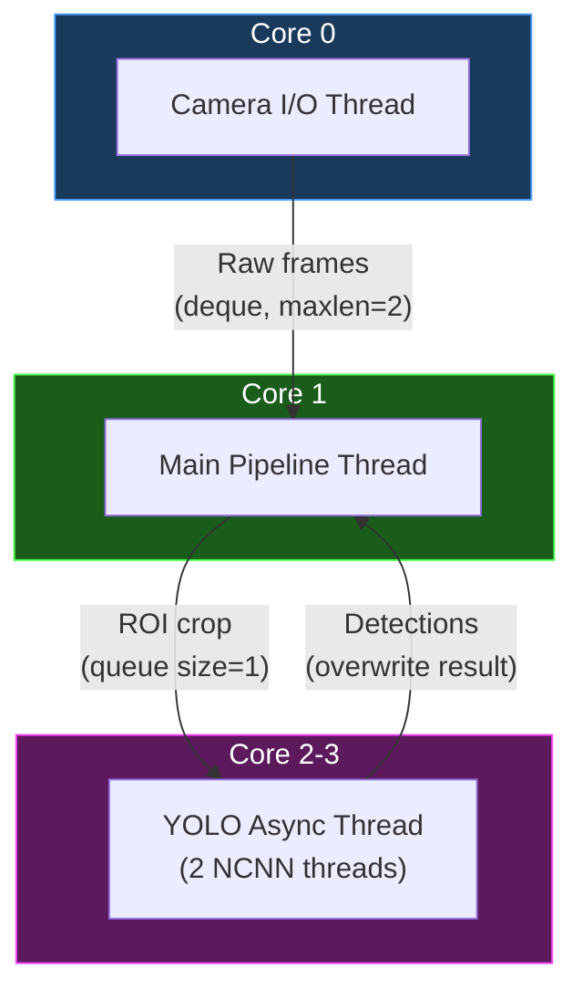
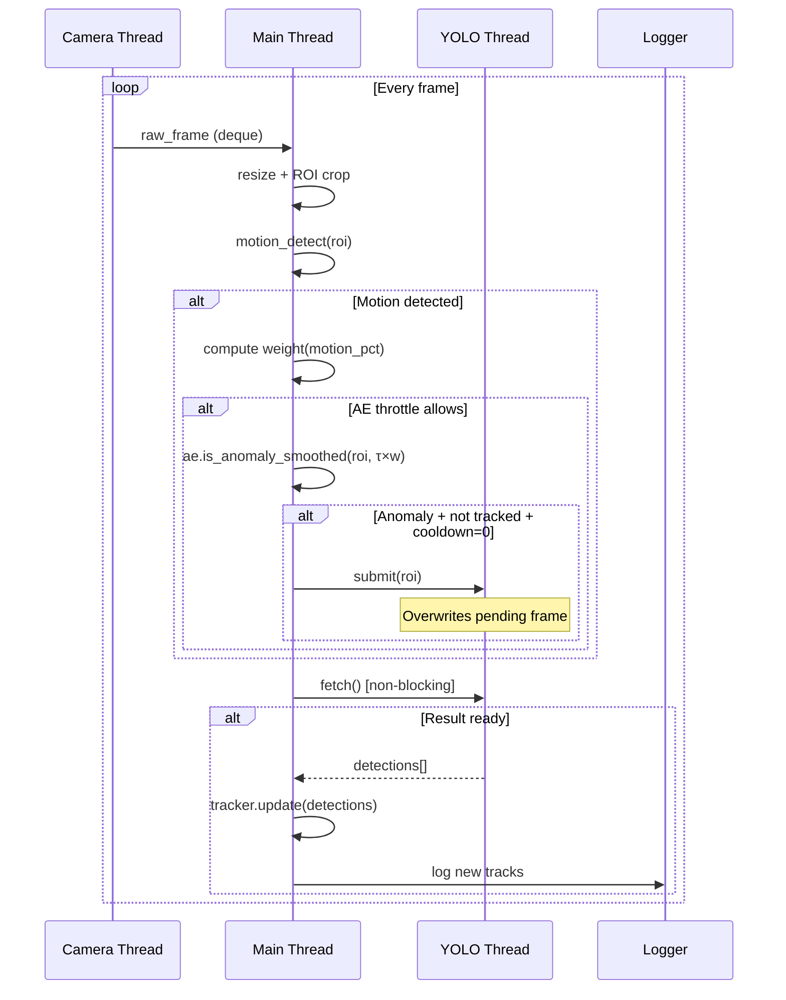
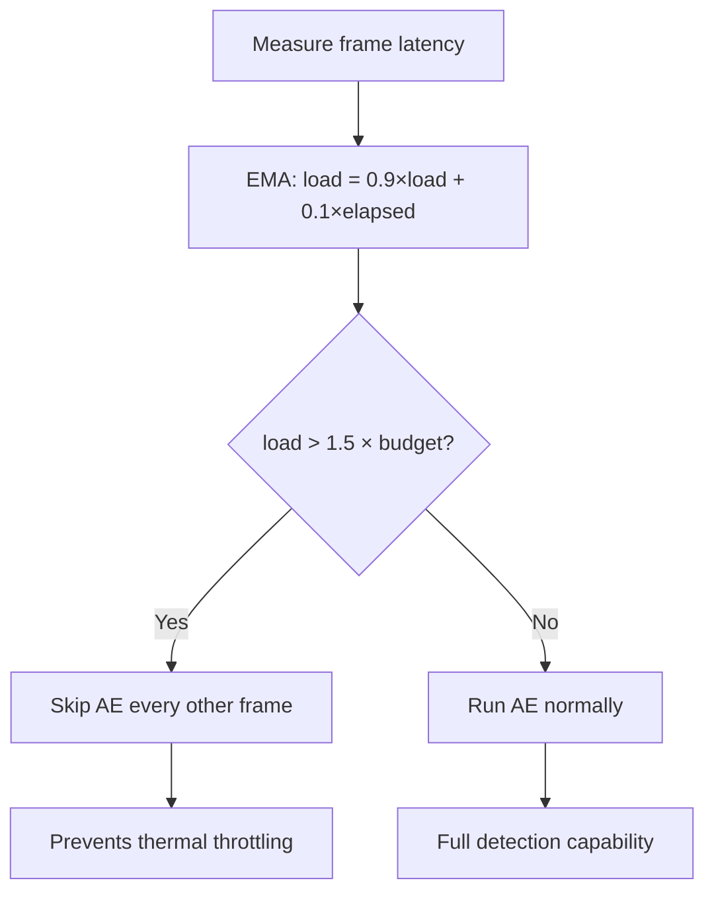

# Architecture Guide

## System Overview

The road anomaly detection system uses a **dual-model architecture** deployed on a Raspberry Pi 4B. This document details the design decisions and data flow.

## Thread Model



### Thread 1 — Camera I/O (Core 0)

**Module**: `preprocessing.py` → `ThreadedCapture`

- Runs `cv2.VideoCapture.read()` in a loop
- Stores latest frame in a thread-safe deque (maxlen=2)
- Decouples frame acquisition from processing
- For video files: reads at source FPS
- For live camera: reads as fast as possible

### Main Thread (Core 1)

**Module**: `pipeline.py` → `run_pipeline()`

Executes the full processing chain per frame:

1. **Resize** → `cfg.proc_width × cfg.proc_height`
2. **ROI Crop** → Bottom `cfg.roi_top` to `cfg.roi_bottom`
3. **Motion Detection** → Frame differencing with contour analysis
4. **Motion Weighting** → Maps motion % to threshold multiplier
5. **AE Pre-filter** → ONNX FP16 inference (throttled)
6. **YOLO Submit** → Non-blocking queue submission
7. **YOLO Fetch** → Check for completed results
8. **Tracker Update** → IoU matching + track lifecycle
9. **Logging** → CSV + JSONL + video writer
10. **Drawing** → HUD overlay

### Thread 2-3 — YOLO Async (Core 2-3)

**Module**: `classifier_ncnn.py` → `YOLOClassifier`

- NCNN inference with 2 internal threads
- Queue size = 1 (latest frame wins)
- Stale result detection (frame ID tracking)
- Non-blocking submit/fetch API

## Data Flow



## Queue Design

### Why Queue Size = 1?

Traditional producer-consumer queues accumulate frames during processing spikes:

```
Traditional Queue (size=10):
  Frame 1 → [1, 2, 3, 4, 5, 6, 7, 8, 9, 10] → Processing frame 1
  Problem: By the time YOLO processes frame 1, frame 10 has passed
  Result: Detections are 300ms stale
```

Our design:

```
Single-slot Queue (size=1):
  Frame 1 → [1] → Processing frame 1
  Frame 5 → [5] → Still processing frame 1 (frame 5 overwrites)
  Frame 1 done → Result discarded (stale, frame 5 is newer)
  Frame 5 processing → [5] → Result used (current)
```

**Benefits**:
- Zero queue growth under load
- Always processes the most recent frame
- Stale results automatically discarded
- Constant memory usage

## Backpressure Mechanism



The budget is derived from the target FPS:
- At 15 FPS target: budget = 66 ms
- Backpressure activates at: 66 × 1.5 = 99 ms
- Effect: AE runs on 50% of frames instead of 33%
