# Autoencoder Guide

## Overview

The convolutional autoencoder serves as a fast **anomaly pre-filter**. It learns to reconstruct *normal* road surfaces; frames with high reconstruction error are flagged as potential anomalies for YOLO processing.

## Architecture

```mermaid
flowchart LR
    subgraph Encoder
        A["Input\n128×128×3"] --> B["Conv 32\n3×3, ReLU"]
        B --> C["MaxPool\n64×64"]
        C --> D["Conv 64\n3×3, ReLU"]
        D --> E["MaxPool\n32×32"]
        E --> F["Conv 128\n3×3, ReLU"]
        F --> G["MaxPool\n16×16"]
    end

    subgraph Latent["Latent Space"]
        G --> H["16×16×128"]
    end

    subgraph Decoder
        H --> I["ConvT 64\n3×3, ReLU"]
        I --> J["ConvT 32\n3×3, ReLU"]
        J --> K["ConvT 3\n3×3, Sigmoid"]
        K --> L["Output\n128×128×3"]
    end

    style Encoder fill:#1a3a5c,stroke:#4a9eff,color:#fff
    style Latent fill:#5c1a1a,stroke:#ff4a4a,color:#fff
    style Decoder fill:#1a5c1a,stroke:#4aff4a,color:#fff
```



## How It Detects Anomalies

1. **Training**: AE is trained on *normal road* images only
2. **Inference**: Given a new frame, AE reconstructs it
3. **Error**: Pixel-wise `|input - reconstruction|` is computed
4. **Decision**: High mean error → road looks "unusual" → likely anomaly

```
Normal road:    Input ≈ Reconstruction  →  Error ≈ 0.03  →  ✓ Normal
Pothole:        Input ≠ Reconstruction  →  Error ≈ 0.09  →  ⚠ Anomaly
Speed bump:     Input ≠ Reconstruction  →  Error ≈ 0.07  →  ⚠ Anomaly
```

## Temporal Smoothing

Single-frame spikes cause false positives. We use a rolling window:

```
Window size = 5 frames
Min hits = 2

Frame errors: [0.03, 0.08, 0.04, 0.09, 0.03]
                      ↑              ↑
                   > threshold    > threshold
                   
Hits = 2 ≥ min_hits → Anomaly confirmed
```

**Without smoothing**: Random AE spike → unnecessary YOLO call  
**With smoothing**: Requires persistence → only real anomalies trigger YOLO

## Motion-Weighted Threshold

The base threshold (0.06) is scaled by motion percentage:

```
effective_threshold = base_threshold × motion_weight

Example:
  motion = 1%  → weight = 1.5 → threshold = 0.09 (skeptical)
  motion = 10% → weight = 1.0 → threshold = 0.06 (standard)
  motion = 60% → weight = 1.8 → threshold = 0.108 (very cautious)
```

## Model Format

### ONNX FP16

The model is stored as FP16 ONNX for optimal performance:

```bash
# Convert from PyTorch
python convert_ae_tflite.py --input model.pth --output models/autoencoder_fp16.onnx
```

### Auto-Detection

At load time, the code automatically detects:
- **Input shape**: Reads from ONNX metadata (overrides config)
- **Input dtype**: Detects `tensor(float16)` vs `tensor(float32)`
- **Casts input**: Automatically converts to expected dtype

```python
inp = session.get_inputs()[0]
self._input_fp16 = (inp.type == "tensor(float16)")
model_shape = inp.shape  # e.g. [1, 3, 128, 128]
self.input_size = model_shape[-1]  # 128
```

## GUI Visualization

The GUI shows three panels side-by-side:

| Panel | What it shows |
|-------|---------------|
| **Input (ROI)** | The 128×128 crop fed to the AE |
| **Reconstruction** | What the AE thinks the road should look like |
| **Error Heatmap** | JET colormap of per-pixel error (hot = anomaly) |

The error heatmap reveals *where* the anomaly is — useful for debugging threshold values.
