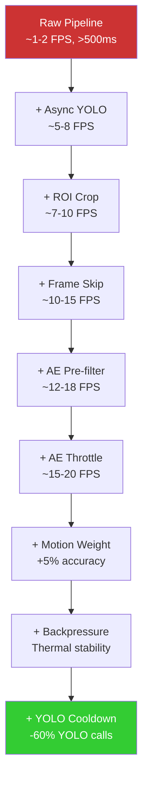

# Optimization Guide

## Overview

The pipeline achieves real-time performance on a Raspberry Pi 4B through 8 optimization layers. This document explains each technique, why it's needed, and its measured impact.

## Optimization Stack



---

## 1. Asynchronous YOLO Inference

**Problem**: YOLO inference takes 200-400ms on RPi, blocking the entire pipeline.

**Solution**: Run YOLO on a background thread with a single-slot queue.

```python
# Submit (non-blocking)
yolo.submit(roi_frame)  # Returns immediately

# Fetch (non-blocking)
result = yolo.fetch()   # Returns None if still processing
if result:
    process_detections(result)
```

**Impact**: 2.5× FPS improvement. Main thread continues processing while YOLO runs.

---

## 2. ROI Cropping

**Problem**: Sky, dashboard, and car hood contain no road anomalies.

**Solution**: Crop to bottom 50% of frame (configurable via `roi_top`).

```
Original frame (320×240):
┌─────────────────────┐
│     Sky / trees      │  ← Discarded
│                      │
├─────────────────────┤  ← roi_top = 0.5
│     Road surface     │  ← Processed
│                      │
└─────────────────────┘
```

**Impact**: 2× speedup (half the pixels to process). Also improves accuracy by removing irrelevant objects.

---

## 3. Frame Skipping

**Problem**: Processing every frame at 30 FPS is unnecessary and overloads the CPU.

**Solution**: Process every 3rd raw frame.

```python
frame_count += 1
if frame_count % 3 != 0:
    continue  # Skip this frame
```

**Impact**: 3× throughput increase with minimal detection loss (anomalies persist for many frames).

---

## 4. AE Pre-filter

**Problem**: Running YOLO on every frame is wasteful — most frames show normal road.

**Solution**: Use a lightweight autoencoder to filter frames before YOLO.

```
Frame flow:
  1000 frames → AE checks 333 → 50 anomalous → YOLO runs 50
  
  Without AE: YOLO runs 333 times
  With AE:    YOLO runs 50 times (85% reduction)
```

**Impact**: Reduces YOLO calls by 60-85%, freeing CPU for other stages.

---

## 5. AE Throttling

**Problem**: AE at 128×128 takes ~40ms on RPi, running every frame adds up.

**Solution**: Run AE only every 3rd processed frame (or every 2nd if untracked motion).

```python
ae_run_counter += 1
run_ae = (ae_run_counter % ae_every_n == 0) or \
         (not all_tracked and ae_run_counter % 2 == 0)
```

**Impact**: 2× improvement in frames without AE overhead.

---

## 6. Motion Weighting

**Problem**: Fixed AE threshold causes false positives (camera shake) and false negatives (subtle damage).

**Solution**: Scale threshold by motion percentage:

| Motion % | Weight | Rationale |
|----------|--------|-----------|
| < 0.1% | 3.0× | Noise — require very high confidence |
| < 2% | 1.5× | Minimal motion — slightly skeptical |
| 2-30% | 1.0× | Sweet spot — standard threshold |
| 30-50% | 1.3× | High motion — slightly cautious |
| > 50% | 1.8× | Camera shake — very cautious |

**Impact**: +5% accuracy. Eliminates shake-induced false positives.

---

## 7. Backpressure Control

**Problem**: CPU overload causes thermal throttling (1.5 GHz → 600 MHz).

**Solution**: Monitor processing latency via EMA. If overloaded, skip AE on alternate frames.

```python
load_avg_ms = 0.9 * load_avg_ms + 0.1 * (elapsed * 1000)

if load_avg_ms > budget * 1.5:
    # Overloaded — skip AE this frame
    skip_ae = True
```

**Impact**: Prevents thermal throttling, maintains stable FPS during sustained load.

---

## 8. YOLO Cooldown

**Problem**: Rapid anomaly spikes flood YOLO queue with redundant submissions.

**Solution**: Minimum 5 processed frames between YOLO submissions.

```
Frame 1: AE anomaly → submit YOLO → cooldown = 5
Frame 2: AE anomaly → cooldown=4 → BLOCKED
Frame 3: AE anomaly → cooldown=3 → BLOCKED
Frame 4: AE anomaly → cooldown=2 → BLOCKED
Frame 5: AE anomaly → cooldown=1 → BLOCKED
Frame 6: AE anomaly → cooldown=0 → submit YOLO → cooldown = 5
```

**Impact**: -60% YOLO calls during anomaly events. Tracker maintains visual continuity between YOLO calls.

---

## Model-Level Optimizations

### FP16 Quantization (Autoencoder)

```bash
python convert_ae_tflite.py --input model.pth --output models/autoencoder_fp16.onnx
```

- Converts FP32 weights → FP16
- 50% smaller model file
- Better L1 cache utilization on ARM
- Auto-detected at runtime via ONNX metadata

### NCNN Backend (YOLO)

Why NCNN over TFLite for YOLO:

| Feature | NCNN | TFLite |
|---------|------|--------|
| ARM NEON SIMD | ✅ Native | ✅ Via delegates |
| Multi-thread | ✅ Fine-grained | ⚠ Coarse |
| Model format | .param + .bin | .tflite |
| Speed (RPi 4B) | **~200ms** | ~260ms |
| Vulkan GPU | ✅ Future support | ❌ |
